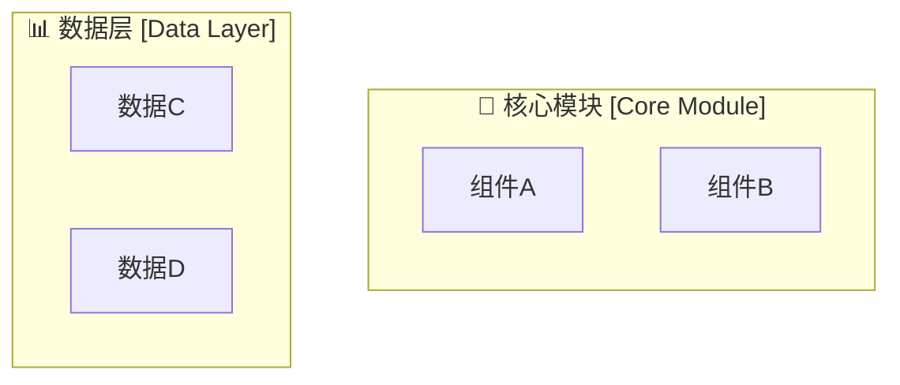
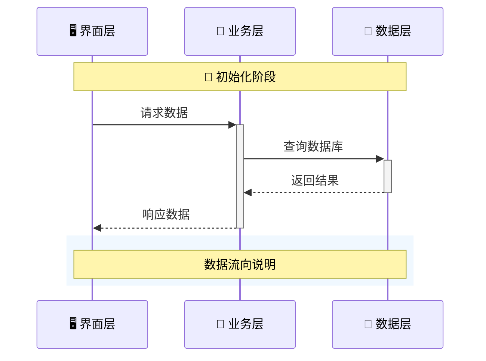
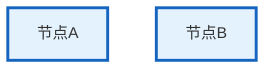

Define the task to a
# 高质量Mermaid图表生成Prompt指南


## 🎯 设计思路


### 核心原则

1. **功能导向**：每个图表都要明确展示特定的架构层面或业务流程

2. **信息层次**：区分主要信息流、次要信息流和辅助信息

3. **视觉清晰**：使用颜色、图标、分组来增强可读性

4. **完整性**：确保数据流向和信号传递路径完整可追踪


### 图表类型选择策略

- **数据模型**：使用flowchart展示数据结构和处理流程

- **服务架构**：使用flowchart LR/TB展示服务层次和调用关系

- **状态管理**：使用flowchart TD展示状态变化和管理流程

- **时序交互**：使用sequenceDiagram展示组件间的时间顺序交互

- **业务逻辑**：使用flowchart TB展示复杂的业务处理流程

- **系统架构**：使用分层flowchart展示整体系统结构


## 📝 格式规范


### 基础语法模板

```mermaid

图表类型 方向

    subgraph "🎯 主要模块名称"

        节点ID["📊 节点显示名称"]

        

        subgraph "子模块名称"

            子节点["具体功能"]

        end

    end

    

    %% 连接关系

    节点A -->|"关系描述"| 节点B

    节点A -.->|"信号/事件"| 节点C

    

    %% 样式定义

    style 节点ID fill:#颜色代码,stroke:#边框颜色,stroke-width:宽度

```


### 命名规范

- **节点ID**：使用简短英文缩写（如WVM, ASM, NVM）

- **显示名称**：使用中文+图标+功能描述

- **子图名称**：功能模块名 + 图标

- **连接描述**：简洁的中文动作描述


## 🎨 美化技巧


### 图标使用规范

```

🌤️ 天气相关    📊 数据/图表    🎯 核心/目标    🧭 导航

🖥️ 界面/UI     📡 信号/通信    ⚙️ 操作/设置    🔍 搜索/查询

💾 存储/缓存    🌐 网络/服务    📱 移动/应用    🏠 主页/首页

📈 趋势/图表    🌅 日出/时间    🔄 循环/刷新    ✅ 成功/完成

❌ 错误/失败    ⏳ 加载/等待    📋 列表/清单    🔗 连接/链接

```


### 配色方案

```css

/* 主要模块颜色 */

核心组件: fill:#e3f2fd,stroke:#1565c0,stroke-width:3px

数据层: fill:#f3e5f5,stroke:#7b1fa2

业务层: fill:#e8f5e8,stroke:#2e7d32

服务层: fill:#e0f2f1,stroke:#00695c

界面层: fill:#fce4ec,stroke:#ad1457


/* 状态颜色 */

成功状态: fill:#c8e6c9

错误状态: fill:#ffcdd2

警告状态: fill:#fff9c4

信息状态: fill:#e1f5fe

```


### 连接线样式

```mermaid

%% 数据流（实线，粗线）

A ==>|"主要数据流"| B


%% 信号流（虚线）

A -.->|"信号/事件"| B


%% 控制流（普通箭头）

A -->|"控制调用"| B


%% 双向交互

A <-->|"双向通信"| B

```


## 📐 布局原则


### 层次化布局

1. **垂直分层**：按照架构层次从上到下排列（UI → ViewModel → Model → Service → Data）

2. **水平分组**：同一层次的相关组件水平排列

3. **逻辑分组**：使用subgraph将相关功能组件分组


### 流向设计

1. **主流向**：从左到右或从上到下表示主要的数据/控制流

2. **反馈流**：使用虚线表示信号、事件、回调等反馈流

3. **交叉最小化**：尽量减少连接线的交叉


### 信息密度控制

1. **适度分解**：复杂图表分解为多个相关的子图

2. **关键路径突出**：使用颜色和线条粗细突出关键路径

3. **辅助信息**：使用note和rect添加说明信息


## 🛠️ 实用语法技巧


### 高级subgraph用法




### 序列图优化




### 样式类定义




## 📋 质量检查清单


### 内容完整性

- [ ] 所有主要组件都已包含

- [ ] 数据流向清晰可追踪

- [ ] 信号传递路径完整

- [ ] 关键接口和方法已标注


### 视觉效果

- [ ] 颜色搭配协调统一

- [ ] 图标使用恰当

- [ ] 文字大小适中

- [ ] 布局平衡美观


### 技术准确性

- [ ] 架构关系正确

- [ ] 数据流向符合实际

- [ ] 组件职责划分清晰

- [ ] 接口调用关系准确


## 🎯 应用示例Prompt


**基础Prompt模板：**

```

请为[系统/组件名称]创建一个Mermaid[图表类型]，要求：


1. 展示[具体要展示的内容]

2. 突出[关键信息点]

3. 使用[指定的布局方向]

4. 包含以下模块：[模块列表]

5. 标注数据流向：[数据流描述]

6. 标注信号传递：[信号流描述]


样式要求：

- 使用图标和颜色区分不同类型的组件

- 主要数据流使用实线粗箭头

- 信号/事件流使用虚线

- 添加适当的分组和注释

```


**具体应用示例：**

```

请为WeatherApp的状态管理系统创建一个Mermaid flowchart，要求：


1. 展示AppStateManager的核心架构和数据流向

2. 突出状态变化的触发和传播机制

3. 使用TB（从上到下）布局

4. 包含以下模块：状态存储、操作接口、数据查询、信号广播

5. 标注数据流向：UI操作 → 状态更新 → 信号发射 → UI刷新

6. 标注信号传递：内部状态变化信号和外部通知信号


样式要求：

- 使用🎯图标表示核心管理器

- 不同功能模块使用不同颜色

- 状态变化使用绿色实线

- 信号传递使用红色虚线

- 添加外部依赖和交互说明

```


        